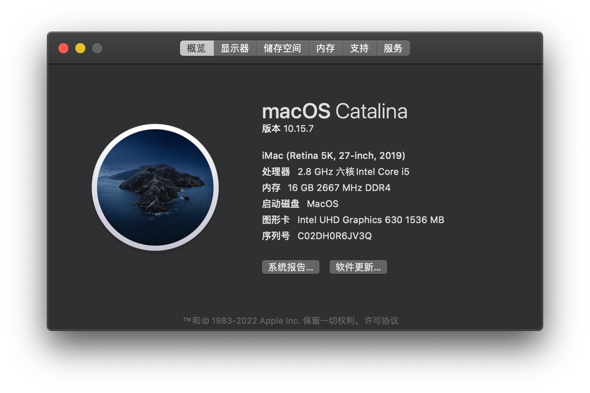
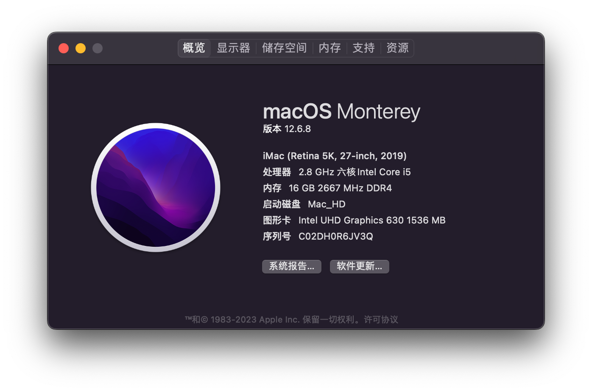

# ASRock H310cm itx/AC + i5 8400 Hackintosh（OpenCore）
`Updated on Sept. 8,2023 by Yale Wei `



English | [简体中文](./README-zh_CN.md)  

ASRock H310cm with i5 8400 PC's EFI configs for hackintosh, It can be using Catalina and Monterey OS, for personality purpose.

#### Status：developing
[](https://github.com/longanw/nuc8i5beh/releases) [](https://github.com/acidanthera/OpenCorePkg/releases/latest) [](https://github.com/OpenIntelWireless/itlwm/releases) [](https://www.apple.com/macos/catalina/) [](https://www.apple.com/macos/monterey/)

#### Specs

| Name             | Information                            |
| ---------------- | ---------------------------------------|
| CPU              | Intel® Core™ i5 8400                  |
| iGPU             | Intel UHD 630                   |
| Lan              | Intel I219-V                           |
| Audio            | Realtek ALC887                         |
| Ram              | 8GB*2 ddr4 2667 Mhz            |
| Wifi + Bluetooth | Intel® Wireless-AC 3168 + Bluetooth 4.2|
| Nvme             | Great Wall GW3300                       |
| SMBios           | iMac19,1                             |
| BootLoader       | OpenCore 0.9.4                         |

#### Drivers

- [x] Intel UHD 630 iGPU HDMI/DP Output
- [x] ALC887 Internal Speakers/Front Panel Speaker
- [x] ALC887 HDMI/DP Audio Output
- [x] All USB Ports 
- [x] SpeedStep / Sleep / Wake
- [x] Intel® Ethernet Connection I219-V
- [x] Intel® Wireless-AC 3168 + Bluetooth 4.2


#### BIOS
Load UEFI Defaults

``` 
Advanced -> Chipset Configuration  -> Onboard HD Audio & Onboard HDMI HD Audio: Enabled
Advanced -> Chipset Configuration  -> VT-d: Disabled
Advanced -> USB Configuration -> XHCI Hand-off: Enabled
Advanced -> CPU Configuration  -> C States Support: Disabled
Advanced -> Super IO Configuration -> Serial Port: Disabled
Security -> Secure Boot: Disabled
BOOT -> CSM: Enabled

```
 
#### Buy me a coffee

| WeChat Pay | Alipay | 
| ---| --- |
|  |  |

#### Credits

- [Apple](https://www.apple.com) 
- [Acidanthera](https://github.com/acidanthera)
- [Rehabman](https://github.com/RehabMan) 
- [daliansky](https://github.com/daliansky) 
- [zxystd](https://github.com/OpenIntelWireless/itlwm)
- [Dortania](https://dortania.github.io/OpenCore-Install-Guide/)
- [gitee.com](https://gitee.com) 
- [github.com](https://github.com) 


